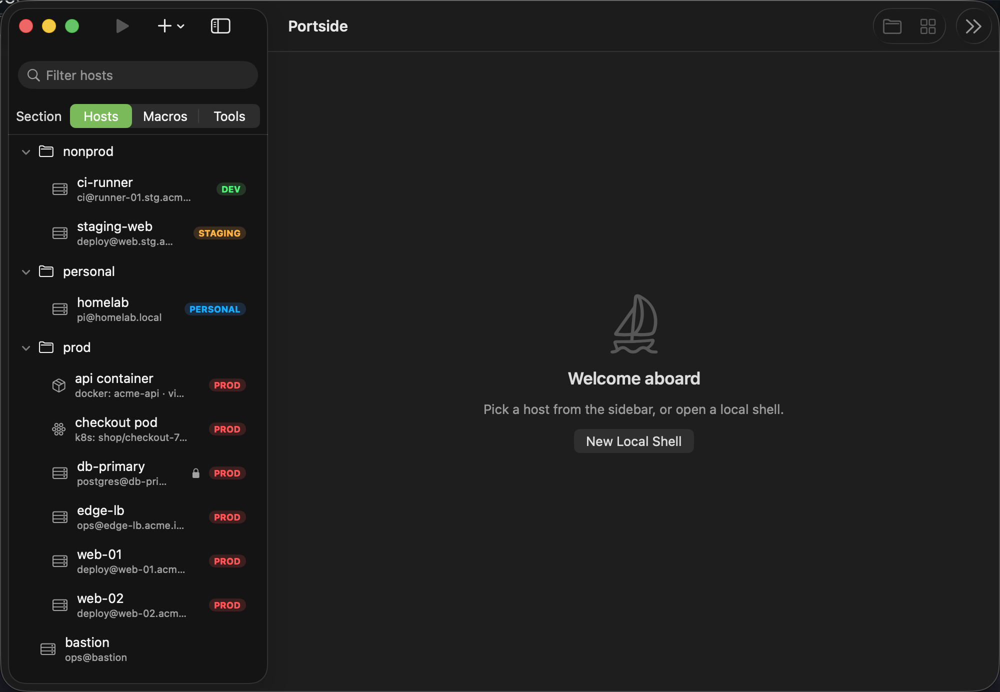
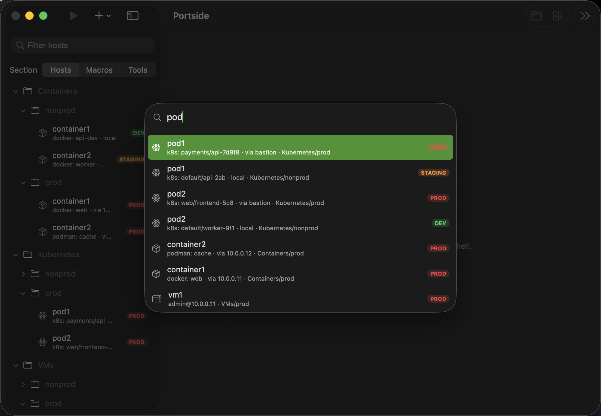
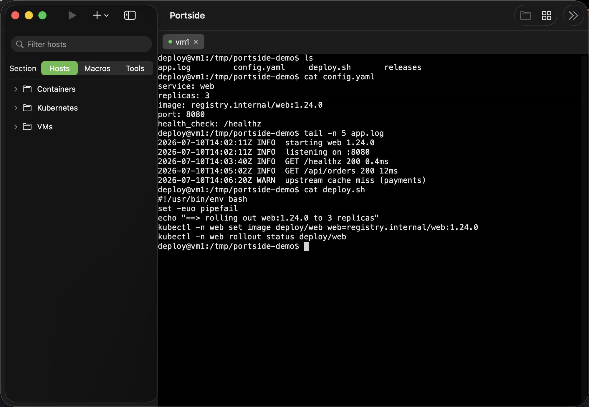
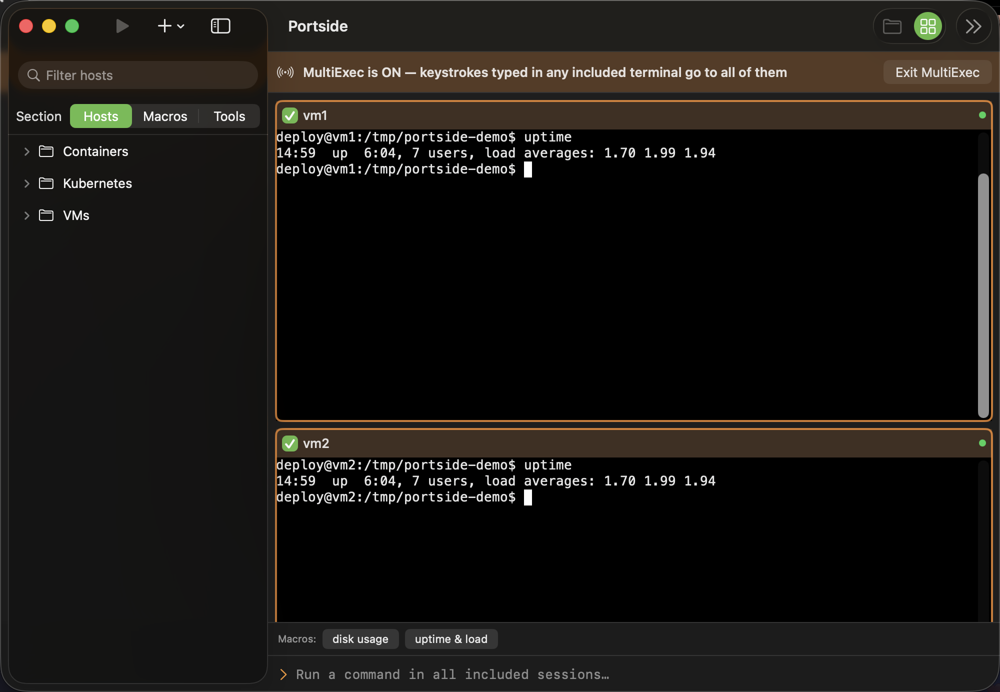
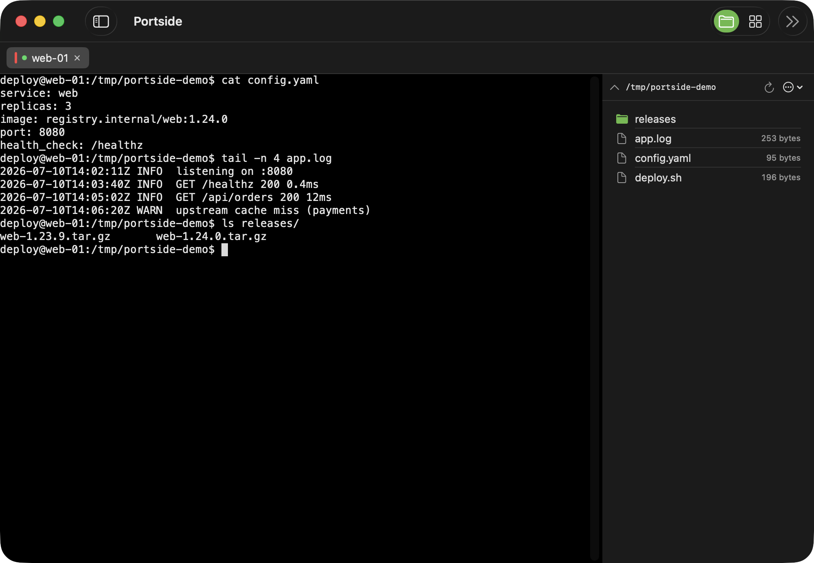

# ⚓ Portside

**A fast, native macOS workbench for people who live in remote terminals.**

Portside is a session manager and terminal for operators who run fleets of
Linux servers — plus their containers, Kubernetes pods, serial consoles, and
legacy telnet endpoints — from a Mac. Connect over OpenSSH or mosh, plug into a
switch with a native serial bridge, and keep every target in one searchable,
foldered library. Multi-host broadcast with guardrails, SFTP, port forwarding,
and credential glue all live in the same native window. No Electron, no web
view: SwiftUI and a real terminal, built around the tools you already use.

> Early days, moving fast. Built on the coast of Maine. ⛵

## Install

Grab the latest notarized build from [Releases](https://github.com/mcglothi/portside/releases/latest), or:

```sh
brew install mcglothi/tap/portside
```

Builds are Developer ID signed and notarized by Apple, and keep themselves
current via Sparkle. Requires macOS 14+.



*One foldered library for SSH and mosh hosts, containers, Kubernetes pods, serial consoles, and telnet endpoints — with transport and environment badges.*



*⌘K Quick Connect fuzzy-searches every saved target and recent connection at once.*



*Real terminal tabs over the OpenSSH you already have configured — keys, agent, and `ProxyJump` chains included.*



*MultiExec broadcasts your keystrokes to every included session — with a loud banner and per-terminal opt-in so you always know what's armed.*



*The SFTP browser rides the same SSH connection as your shell — no second login — with drag-and-drop transfer right beside the terminal.*

## Why

macOS has excellent terminal *emulators* — iTerm2 and WezTerm are superb. What
it lacks is a native **operator workflow**: a session library you can organize,
broadcast execution across a fleet with real safety UX, credential glue, file
transfer, and container/Kubernetes access — in one fast surface. Portside
exists to fill that gap without giving up native speed and macOS polish.

**Opinionated bets:**
- Win on **workflow density**, not protocol count. SSH-first, with the console
  transports operators still need close at hand.
- Multi-host execution deserves **safety UX as a flagship feature**, not a checkbox.
- **Local-first, self-owned state.** Your session library is a JSON file on
  your disk, not a cloud sync subscription.
- Lean on **OpenSSH itself** for transport — your `~/.ssh/config`, agent,
  keys, and `ProxyJump` chains work on day one, unmodified.

## What works today

- **Session library with folders** — organize hosts under `prod`, `nonprod`,
  `personal`, nested as deep as you like. Everything is editable in place.
- **Containers & Kubernetes as first-class sessions** — save a docker/podman
  container or a `kubectl` pod (context-aware for NKP, GKE, and any kubeconfig)
  the same way you save a host. It runs on this Mac or through an SSH jump host,
  and shows up in the library, Quick Connect, and recents like everything else.
  Browse live `docker ps` / `kubectl get pods` from the editor so you never
  have to remember a churning name.
- **`~/.ssh/config` import** — seeds the library on first launch (follows
  `Include` directives); re-import merges new hosts anytime.
- **Import from MobaXterm** — bring over `.mxtsessions` / `.mxtmacros` files
  with their folder structure intact.
- **Export & import** — back up or move your library as portable JSON;
  sessions (with folders) and macros export separately and re-import into any
  Portside install. Passwords stay in the Keychain and never travel.
- **Native terminal tabs** — [SwiftTerm](https://github.com/migueldeicaza/SwiftTerm)
  rendering across OpenSSH, mosh, serial, and telnet sessions. Local shells too
  (⌘T). Find in scrollback with ⌘F.
- **Mosh roaming** — opt any SSH host into mosh for sessions that survive sleep
  and network changes. Portside respects your SSH alias, key, port, and saved
  password during bootstrap, and falls back to SSH when mosh is unavailable.
- **Native serial consoles** — connect directly to live `/dev/cu.*` devices
  without spawning `screen`. Choose baud rate, data bits, parity, stop bits,
  and flow control; logging, run-on-connect, and MultiExec work on the same path.
- **Telnet for legacy endpoints** — save host and port, handle RFC 854 option
  negotiation cleanly, and use the same terminal, logging, and MultiExec tools.
  Telnet sessions carry a prominent **UNENCRYPTED** badge.
- **Quick Connect (⌘K)** — a fuzzy-search command palette over the whole
  library; empty query lists recent hosts so it doubles as fast reconnect.
- **MultiExec** — tile every session in a grid and type into all of them at
  once. Per-terminal include toggles, a broadcast command bar for deliberate
  one-shot commands, and a loud orange banner so you always know when you're
  armed.
- **Environment badges & protected hosts** — tag sessions prod / staging /
  dev / personal for color-coded badges in the sidebar and tabs. Protected
  hosts stay **out of MultiExec by default** and require explicit
  confirmation to join a broadcast.
- **Macros** — named command sequences, run in the active terminal or across
  the whole MultiExec grid. Per-host **run-on-connect** commands too.
- **SFTP browser** — per-session remote file pane riding the same SSH
  connection (no re-auth), with drag/drop upload and drag-out download.
- **Port forwarding** — saved `-L` / `-R` / SOCKS tunnels with live status,
  start/stop, and launch-at-startup, tunneled through any host in the library.
- **Recent connections** — the welcome screen keeps a "jump back in" list of
  the hosts you last connected to, one click to reconnect.
- **Session logging** — per-host log folders with compression and search.
- **Keychain passwords** — per-host saved passwords supplied to ssh
  automatically; nothing ever lands in the JSON library.
- **Auto-updates** — Sparkle-powered in-app updates from GitHub Releases.

## Roadmap

### Next release — terminal foundation

- Increase scrollback substantially and make its retention configurable.
- Enable SwiftTerm's Metal renderer behind a safe preference; benchmark and
  validate it before making performance claims.
- Publish a tested terminal-compatibility matrix covering true color, Unicode,
  links, mouse input, image protocols, and known gaps.
- Add the highest-value terminal comforts: per-profile font/theme choices and
  shell integration or prompt markers.
- Investigate configurable font ligatures, but do not claim support until it is
  deliberate and tested.

- Session restore / pinned workspaces
- Touch ID gating for saved credentials (Vaultwarden references later)
- Split panes and pinned layouts

## Building

Requires Swift 6+ (Xcode Command Line Tools are enough):

```sh
# Run for development
swift run

# Build a standalone Portside.app
Scripts/make_app.sh
open build/Portside.app
```

## Status & contributions

Pre-1.0 and evolving quickly; expect sharp edges. Issues and ideas welcome —
especially from fellow operators who live in the terminal.
